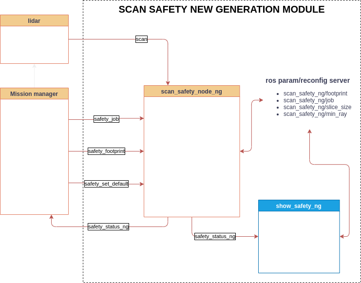

# SCAN SAFETY NEW GENERAL MODULE

## 1. Chức năng

Sử dụng dữ liệu lidar để phát hiện vật cản theo vùng

## 2. Cách sử dụng

### 2.1. Sơ đồ khối



### 2.2. Nguyên lý hoạt động

- node `scan_safety_node_ng` sẽ nhận request về các vùng safety (`/safety_job` topic) và footprint (`/safety_footprint` topic), sau đó vừa xử lý với dữ liệu `/scan`, vừa lưu param.
- Giá trị mặc định của safety_job và safety_footprint được lưu trong file [default.json](../scripts/default.json).
- Nếu nhận được request `safety_set_default`, giá trị hiện tại của safety_job và safety_footprint sẽ được lưu vào trong file làm giá trị mặc định.
- Để visualize giá trị output (`safety_status_ng`), có thể dùng node `show_safety_ng`

### 2.3. Các topic

### 2.3.1. Subscribed topic

- `safety_job` (std_stamped_msgs/StringStamped):
  Chuỗi json quy định cấu hình của các vùng safety.
  ***Lưu ý: Điểm đầu và điểm cuối của mỗi vùng phải trùng nhau***
  Ví dụ 1:

  ```json
  '{"safety": [{"index": 0, "data": [[-0.7, -0.7], [-0.7, 0.7], [0.7, 0.7], [0.7, -0.7], [-0.7, -0.7]]}, {"index": 1, "data": [[-0.8, -0.8], [-0.8, 0.8], [1.0, 0.8], [1.0, -0.8], [-0.8, -0.8]]}, {"index": 2, "data": [[-0.9, -0.9], [-0.9, 0.9], [1.3, 0.9], [1.3, -0.9], [-0.9, -0.9]]}, {"index": 3, "data": [[-1.0, -1.0], [-1.0, 1.0], [1.7, 1.0], [1.7, -1.0], [-1.0, -1.0]]}]}'
  ```

  Ví dụ 2:

  ```json
  '{"safety": [{"index": 0, "data": [[-0.7, -0.5], [-0.7, 0.5], [0.9, 0.5], [0.9, -0.5], [-0.7, -0.5]]}, {"index": 1, "data": [[-0.8, -0.6], [-0.8, 0.6], [1.3, 0.6], [1.3, -0.6], [-0.8, -0.6]]}, {"index": 2, "data": [[-0.9, -0.7], [-0.9, 0.7], [1.9, 0.7], [1.9, -0.7], [-0.9, -0.7]]}]}'
  ```

- `safety_footprint` (std_stamped_msgs/StringStamped):
  Chuỗi json quy định cấu hình của footprint.
  ***Lưu ý: Điểm đầu và điểm cuối của mỗi vùng phải trùng nhau***
  Ví dụ 1:

  ```json
  '{"footprint": [[0.6, 0.5], [-0.6, 0.5], [-0.6, -0.5], [0.6, -0.5], [0.6, 0.5]]}'
  ```

  Ví dụ 2:

  ```json
  '{"footprint": [[0.7, 0.5], [-0.7, 0.5], [-0.7, -0.5], [0.7, -0.5], [0.7, 0.5]]}'
  ```

- `safety_set_default` (std_stamped_msgs/StringStamped):
  Chuỗi lệnh request lưu giá trị hiện tại làm giá trị mặc định.
  Giá trị yêu cầu: `"save"`

- `scan` (sensor_msgs/LaserScan):
  Topic laser của lidar

### 2.3.2. Published topic

- `safety_status_ng` (safety_msgs/SafetyStatus):
  Trả về giá trị các vùng (1 là có vật cản trong vùng, 0 là không có)

  ```msg
    Header header
    int8 id
    string name
    int8 job           # current job - always = 0
    int8[] fields      # fields status
  ```

## 2.4. Chạy chương trình

- Sau khi đã chạy chương trình AGV, chạỵ lệnh sau:

```sh
rosrun scan_safety scan_safety_node_ng.py
```

- Để theo dõi hoạt động của node, chạy thêm lệnh: 

```sh
rosrun scan_safety show_safety_ng.py
```
