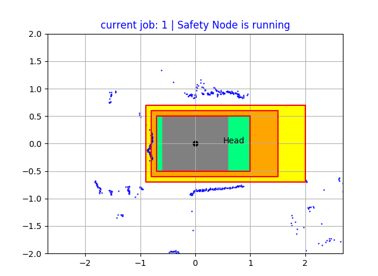

# Readme

- Xác định các vùng an toàn
- Phát hiện vật cản trong các vùng an toàn

## Requirements

- safety_msgs: <https://gitlab.com/mkac-agv/safety_msgs>

## Usage

Sử dụng `job_0` được cấu hình dynamic_reconfigure để chỉnh sửa, sau khi cấu hình xong thì copy (manual) sang job_1..n để sử dụng.

- Chạy `roslaunch scan_safety scan_safety.launch` trên pc robot
- Chạy `rosrun scan_safety show_safety.py` trên workstation pc để view.
- Chạy `rosrun rqt_reconfigure rqt_reconfigure` để thay đổi job, cập nhật tham số. (Muốn lưu lại tham số sau khi thay đổi thì hiện tại phải ghi trực tiếp vào file `config/safety_config.yaml`, chưa có cơ chế lưu trực tiếp từ reconfigure)

## Configuration

### File config

File: `config/safety_config.yaml`

Giải thích từng param có trong comment trong file trên

### Dynamic reconfigure


* `current_job` và `foot_print` có thể thay đổi bằng [mission_manager](https://gitlab.com/mkac-agv/mission_manager)

## Giao tiếp

Phản hồi trạng thái safety:

File: safety_msgs/SafetyStatus.msg
```
Header header
uint8 id
string name
uint8 job           # current job
uint8[] fields      # fields status
```

## Tính toán


Bài toán phát hiện vật cản bằng lidar trong một vùng được phân tích thành:
- Tạo một polygon bao quanh robot được tạo từ các đỉnh $`V_i`$
- Xét điểm $`S_i`$ nằm trong hay ngoài polygon nói trên.
- Nếu có nhiều điểm $`S_i`$ gần nhau nằm trong polygon trên, tức là có vật cản nằm trong vùng đang xét

Các bước tính toán:
- Polygon này được chia thành các vùng $`Z_i`$ tương ứng được tạo bởi tâm Lidar $`O`$ và hai đỉnh kề nhau $`V_i`$ và $`V_{i+1}`$
- Chuyển đổi tọa độ của $`V_i(x_i, y_i)`$ từ hệ tọa độ Descartes sang hệ tọa độ Polar với gốc ở $`O`$ có tọa độ tương ứng là $`V_i(r_i, \theta_i)`$
- Xét điểm $`S_i(r_{si},\theta_{si})`$ có nằm trong vùng $`Z_i`$ được tạo bởi $`O`$, $`V_i`$, $`V_{i+1}`$ hay không??? Cần thỏa mãn 2 điều kiện:

  - (1) $`\theta_i \leq \theta_{si} \leq \theta_{i+1}`$
  - (2) $`r_{si} \leq r`$

  

  - Phương trình đường thẳng qua $`V_i`$ và $`V_{i+1}`$ trong hệ Polar được biểu diễn như sau (Tham khảo thêm tài liệu [1]):

    ```math
    r = \frac{p}{\cos(\theta - \phi)}
    ```
    Trong đó: $`p`$ và $`\phi`$ là khoảng cách từ $`O`$ tới hình chiếu $`H`$ của $`O`$ lên đường thẳng, $`\phi`$ là góc tạo bởi tia $`Ox`$ và $`OH`$ (Hay hình chiếu $`H`$ có tọa độ trong hệ Polar là $`(p, \phi))`$

   - Do đó cần xác định điểm $`H(p, \phi)`$

  - Xác định điểm $`P(r, \theta)`$ là giao điểm của tia $`OS_i`$ và đường thẳng qua $`V_i, V_{i+1}`$ bằng cách thay $`\theta_{si}`$ vào công thức đường thẳng vừa tìm trên.

- Kiểm tra điều kiện (1) và (2) ở trên để xác định $`S_i`$ thuộc $`Z_i`$ hay không.

- Duyệt hết lần lượt qua các $`Z_i`$ ta biết được $`S_i`$ có thuộc polygon được tạo bởi các đỉnh $`V_i`$ hay không, hay gọi là có thuộc `field_i` hay không

- Duyệt qua tất các các điểm $`S_i`$ từ dữ liệu lidar.
- Để xác định vật cản, xét một thanh trượt bao gồm $`m`$ phần tử (tương ứng param: `slice_size`, mặc định là 5) lidar liên tiếp nhau, nếu trong $`m`$ điểm liên tiếp nhau đó có số điểm thuộc `field_i` lớn hơn $`n`$ (tương ứng param: `min_ray`, mặc định là 3) thì coi là có vật cản trong `field_i`

## Show scan

```
rosrun scan_safety show_safety.py
```

Hiển thị scan (như hình)



- 3 vùng được đánh dấu giới hạn bằng đường biên màu đỏ
- Nếu không có vật cản thì được tô màu xanh
- Nếu có vật cản, lần lượt từ vùng ngoài vào sẽ có màu vàng, cam, đỏ.
- Các chấm màu xanh dương là các điểm từ laser scan

## Phản ứng của rb (Khi `publish_cmd = true`)

- Khi có vật cản ở vùng nào, robot sẽ di chuyển với vận tốc tối đa là theo `v_max` tương ứng, khi vùng trong cùng (vùng 1) có vật cản thì rb sẽ dừng lại.

## Một số hàm

### [updateFields(self)](https://gitlab.com/mkac-agv/scan_safety/-/blob/master/scripts/scan_safety_node.py#L132)

- Được gọi khi bắt đầu node hoặc khi có sự thay đổi job, thay đổi đỉnh của field.
- Nhiệm vụ chính: Cập nhật tham số chứa đỉnh của các field, tính các hệ số của đường thẳng đi qua mỗi 2 đỉnh trong hệ Polar, hệ số để xét góc.
- Cập nhật vào mảng `self.Fields` (`[field1[zone1[p, phi, theta_P, theta_Q, k, i],...], field2[zone1..]`: Trong đó, Fields là vùng đc bao quanh bởi các đỉnh, Zone là vùng tạo bởi gốc O và đường thẳng qua 2 đỉnh liền nhau. Mỗi Field là tổng hợp của các zone được tạo bởi 2 đỉnh liền nhau.

- Trong đó, thông tin của 1 zone là mảng `[p, phi, theta_P, theta_Q, k, i]`:
  
  - `p, phi`: Tọa độ của điểm H, hình chiếu của O lên đường thẳng tạo bởi $`V_i, V_{i+1}`$
  - `theta_P, theta_Q`: Tọa độ góc của 2 đỉnh $`V_i, V_{i+1}`$
  - `k` là hệ số để xét xem điểm $`S_i`$ có nằm giữa 2 đỉnh hay không. `k=1` nếu $`|\theta_P - \theta_Q| < \pi`$ và ngược lại thì bằng -1
  - `i` là số thứ tự zone (dùng để debug)

### [updateFootprint](https://gitlab.com/mkac-agv/scan_safety/-/blob/master/scripts/scan_safety_node.py#L175)

Tương tự hàm `updateFields`, nhưng hàm này dùng để cập nhật cho footprint. Tách ra hàm riêng vì mục đích sử dụng khác nhau (để tiện cho việc sử dụng vòng lặp)

### [scanCallback](https://gitlab.com/mkac-agv/scan_safety/-/blob/master/scripts/scan_safety_node.py#L198)

- Hàm này được gọi mỗi khi có dữ liệu scan (mảng chứa các điểm scan $`S_i`$)
- Kiểm tra footprint: Duyệt qua các điểm scan, nếu điểm nào thuộc trong vùng footprint thì xóa khỏi mảng (bỏ qua)
- Kiểm tra vật cản:
  - Duyệt qua các vùng an toàn từ trong ra ngoài
  - Duyệt qua các điểm scan
  - Duyệt qua các vùng (zone) cảm biến:
    - Tính R (bán kính của giao điểm tia $`OS_i`$ và cạnh $`V_i, V_{i+1}`$), so sánh với `range` của điểm $`S_i`$
    - Xét góc của điểm $`S_i`$ so với $`\theta_P, \theta_Q`$, tính tích của hiệu giữa góc của $`S_i`$ và 2 góc của 2 đỉnh, sau đó nhân với hệ số `k` tính ở hàm `updateFields` trên. Nếu tích này âm thì $`OS_i`$ nằm giữa $`OV_i`$ và $`OV_{i+1}`$ (Có thể vẽ ra để dễ hình dung ^^)
  - Nếu điểm scan $`S_i`$ nằm trong zone, append giá trị 1 vào mảng `slice_arr`, nếu ngoài thì append giá trị 0.
  - Cắt các phần tử ở đầu mảng `slice_arr` để duy trì kích thước mảng.
  - Nếu tổng các phần tử của mảng `slice_arr` > `MinRay` thì cho rằng có vật cản trong vùng này.
  - Cập nhật mảng obstacle.

### Hàm [cmdVelCB](https://gitlab.com/mkac-agv/scan_safety/-/blob/master/scripts/scan_safety_node.py#L72)

- Được gọi khi có giá trị vận tốc được publish từ topic định nghĩa bởi param `~/cmd_vel_input`
- Nếu vận tốc dài lớn hơn `v_max` được định nghĩa tương ứng với mỗi mức an toàn, cập nhật `self.vx` và `self.omega` tương ứng `v_max` của mức đó.
- Cập nhật thời gian cập nhật vận tốc

### publish thông tin vật cản và vận tốc an toàn

- Publish mảng chưa thông tin vật cản `self.obstacles` (chứa n phần tử, trong đó n là số fields của job đang thực hiện) tại vòng lặp chính.
- Publish vận tốc an toàn: nếu ở chế độ publish vận tốc an toàn (`self.is_publish_vel=1`), có vật cản và có vận tốc đầu vào (kiểm tra thời gian cập nhật vận tốc) thì sẽ publish vận tốc an toàn.
## Tham khảo

[1]. [Polar_coordinate_system.pdf](./Polar_coordinate_system.pdf)
